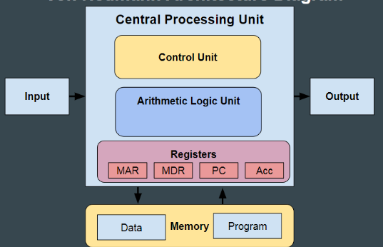
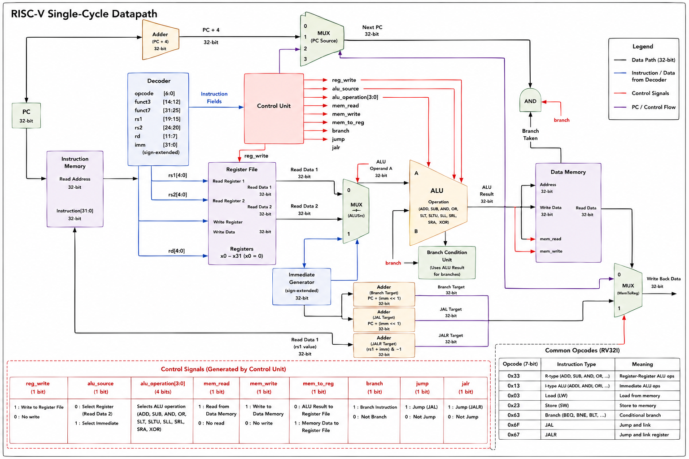

# RV32Iarchmodel
RV32I architecture model building from scratch to check functionality, it has baseline 32-bit integer configuration of RISC-V containing 40 basic integer instructions and 32 32 bit GPRs
# Simulation path 
RISC-V Assembly / Machine Code -> Instruction Memory -> Fetch Instruction -> Decode -> Execute -> Register File / Memory -> Update PC -> Repeat \

# Important to understand
**Registers:** There are 32 registers each of 32 bits\
**Program Counter:** Indicates address of current instruction, each instruction is of 32 bits PC -> PC+4 [memory is byte-addressable, 1byte = 8bits]\
**Instruction Types:** R-type: reg-reg (add, sub,..) I-type: Short immediate constants and loads (addi, lw) S-type: Store to memory (sw) B-type: Conditional branch (sometimes called SB-type) U-type: Upper immediate(e.g., lui, auipc) J-type: Unconditional jump (jal)\
        Bit field Layout: 
** Opcode vs Type: **\
|Opcode| Binary  | Instruction group |\
\
| 0x33 | 0110011 | R-type            |\
| 0x13 | 0010011 | I-type arithmetic |\
| 0x03 | 0000011 | Loads             |\
| 0x23 | 0100011 | Stores            |\
| 0x63 | 1100011 | Branches          |\
| 0x6F | 1101111 | JAL               |\
| 0x67 | 1100111 | JALR              |

# Block diagram with all the signals

# Steps to run the test on this functional model

1. Add the test file to CMakeLists.txt to get the executable [ Example below]
add_executable(test_arithmetic \
    tests/test_arithmetic.cpp  \
\
    src/cpu/cpu.cpp\
    src/cpu/control_unit/control_unit.cpp\
    src/cpu/decoder/decoder.cpp\
    src/cpu/alu/alu.cpp\
    src/cpu/registers/register_file.cpp\
    src/cpu/registers/pc.cpp

    src/memory/memory.cpp\
)\

2. Make sure test_arithmetic.cpp has main()
3. mkdir build && cd build && cmake ..
4. cmake --build . --config Debug
5. .\Debug\test_arithmetic.exe 

